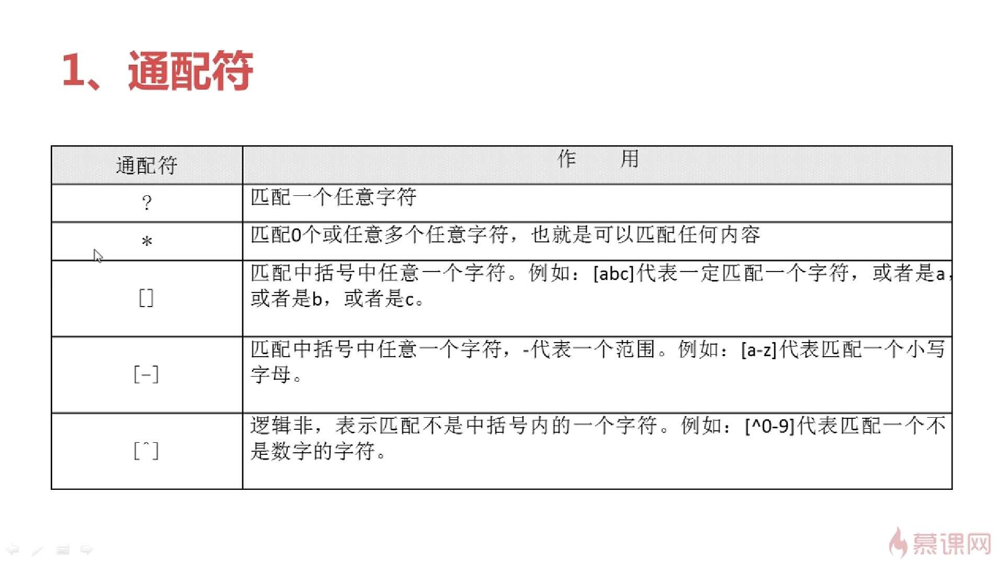
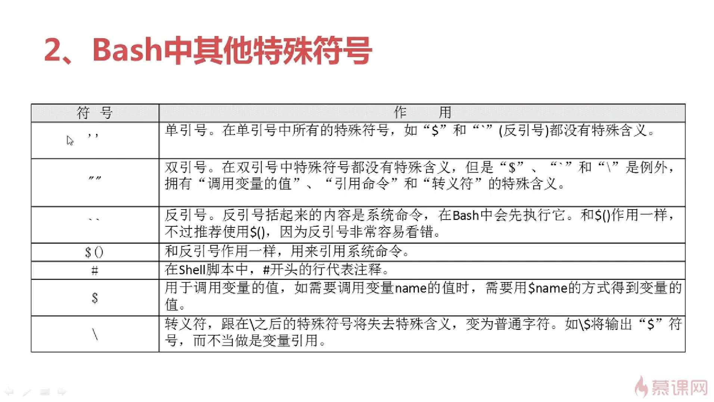
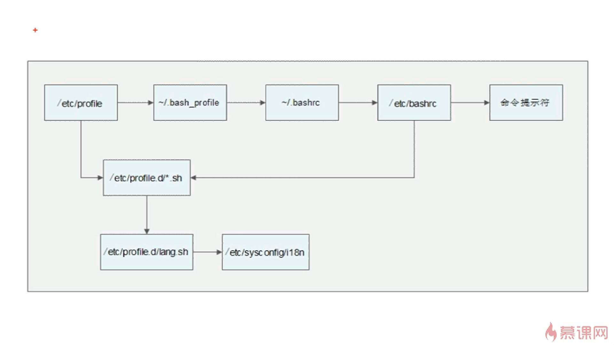
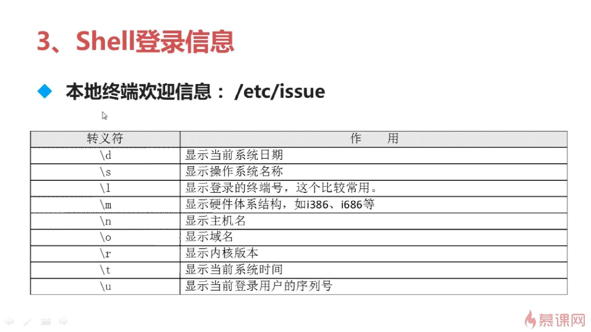
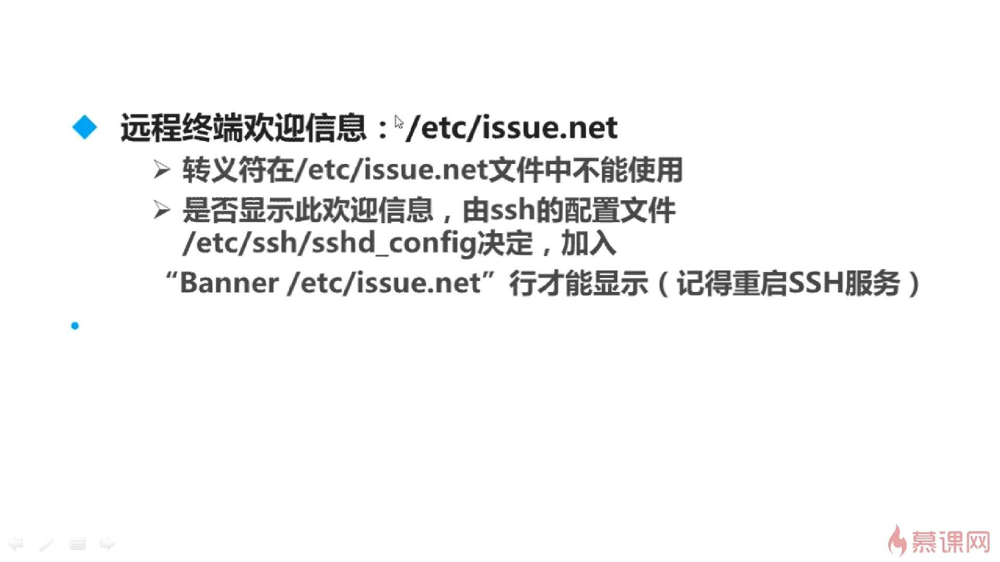

[toc]
# 命令别名
## `alias`
`查看系统中所有的命令别名`
## `alias 别名='原命令'`
`设定命令别名`
```sh
alias ll='ls -l'
```
## `unalias 别名`
`删除别名`
```sh
unalias ll
```
# 环境变量
## `vi ~/.bashrc`
`写入环境变量配置文件`

# 快捷键
快捷键|描述
---|---
ctrl+c|强制终止当前命令
ctrl+l|清屏
ctrl+a  |  光标移动到命令行首
ctrl+e  |  光标移动到命令行尾
ctrl+u  |  从光标所在位置删除到行首
ctrl+z  |  把命令放入后台
ctrl+r  |  在历史命令中搜索

# 历史命令
`history [选项][历史命令保存文件]`

**选项**
> -c:清空历史命令
> -w:把缓存中的历史命令写入历史命令保存文件~/.bash_history
```
使用`!字符串`重复执行最后一条已该字符串开头的命令
!cat
!ls
```
# 标准输入输出
设备|设备文件名|文件描述符|类型
---|---|---|---
键盘  | /dev/stdin  | 0  | 标准输入
显示器  | /dev/sdtout  | 1  | 标准输出
显示器  | /dev/sdterr  | 2  | 标准错误输出

# 输出重定向
类型|符号|作用
---|---|---
标准输出重定向|命令 > 文件|以覆盖的方式，把命令的正确输出<br/>输出到指定的文件或设备当中
&nbsp;|命令 >> 文件|以追加的方式，把命令的正确输出<br/>输出到指定的文件或设备当中
标准错误输出重定向|错误命令 2>文件|以覆盖的方式，把命令的错误输出<br/>输出到指定的文件或设备当中
&nbsp;|错误命令 2>>文件|以追加的方式，把命令的错误输出<br/>输出到指定的文件或设备当中

类型|符号|作用
---|---|---
正确输出和错误输出<br>同时保存|命令 > 文件 2>&1|以覆盖的方式，把正确输出和错误<br/>输出都保存到同一个文件中
&nbsp;|命令 >> 文件 2>&1|以追加的方式，把正确输出和错误<br/>输出都保存到同一个文件中
&nbsp;|命令 &>文件|以覆盖的方式，把正确输出和错误<br/>输出都保存到同一个文件中
&nbsp;|命令 &>>文件|以追加的方式，把正确输出和错误<br/>输出都保存到同一个文件中
&nbsp;|命令>>文件1 2>>文件2|把正确的输出追加到文件1中，把<br/>错误的输出追加到文件2中

# 多命令顺序执行
多命令执行符|格式|作用
---|---|---
;|命令1;命令2|多个命令顺序执行，命令之间没有任何逻辑关系
&&|命令1&&命令2|逻辑与<br>当命令1正确执行，则命令2才会执行<br>当命令1执行不正确，则命令2不会执行
\|\| |命令1\|\|命令2|逻辑或<br>当命令1执行不正确，则命令2才会执行<br>当命令1执行正确，则命令2不会执行

```sh
ls &>/dev/null && echo yes || echo no
```
# 输入重定向
`wc [选线][文件名]`
***选项***
> -c:统计字节数
> -w:统计单词数
> -l:统计行数

# 管道符
`命令1 | 命令2`
`命令1的正确输出作为命令2的操作对象`

# 通配符


# 其他特殊符号


# 环境变量文件
- /etc/profile
- /etc/profile.d/*.sh
- ~/.bash_profile
- ~/.bashrc
- /etc/bashrc

# 环境变量文件加载顺序


# 其他配置文件
- .bash_history `历史命令`
- .bash_logout `注销时生效的环境变量`

# 登录显示信息
- 登录前


- 登录后
`/etc/motd`
`不管是本地登录，还是远程登录，都可以显示此欢迎信息`
