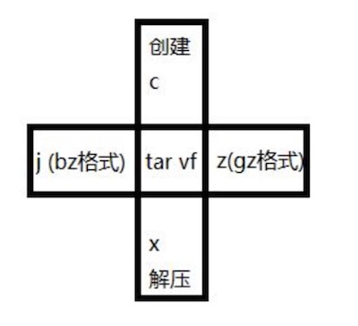

[toc]

# 第二章 安装与开关机
## 关机
> shutdown , halt , poweroff
## 重启
> reboot
## 图形界面下如何进入字符界面?
> 右键->终端->init 3 或 编辑/etc/inittab ,让启动级别为 3（回到图形界面 init 5）

# 第三章 Linux 的基本命令

## which :显示命令路径
>[root@localhost ~]# which pwd
>/bin/pwd
>[root@localhost ~]#  which adduser
>/usr/sbin/adduser

## 显示当前工作路径下的所有文件路径:
1. ls 查看目录
1. ls -l 已详细信息显示
1. ls -a 显示隐藏文件
1. ls -h 格式化文件大小显示

## 在当前工作路径创建文件
- touch 文件名称
  - touch tmp.txt
  - sudo touch /usr/local/bin/composer 创建文件

## 创建目录
- 创建1个或多个目录
    - mkdir dir1 [dir2] [dir3]
    - mkdir dir{5,6,7}
- 创建级联目录
    - mkdir -p /d1/d2/d3
## cp拷贝文件
- cp 源文件夹/文件 目标文件夹/文件
  - cp ./dir1 ./dir2
- cp -r dir1/ /dir2/  递归拷贝

## 删除目录
> rmdir 删除空目录
## 删除文件
>1. rm -r 递归删除
>1. rm -f 强制删除
>1. rm -rf 递归强制删除
>1. rm -f *.conf 删除所有已.conf结尾的文件

### 软连接（相当于Windows的快捷方式）
>ln -s 源文件 链接文件
### 硬链接
>ln 源文件 链接文件

## 移动（mv）修改文件名
1. mv name1 name2
1. mv japan/ /tmp/japan1 目标文件和原文件在同一个目录下即为改名 命令
1. mv -v name1/ /dir/name2/ 显示移动进度

# 第四章 文件的常用命令

## 文本文件查看

### 文件查看  more,less,head,tail,cat

*[more 最后一屏时自动退出,less 不自动退出,按 q 退出,也可以 ctrl+b 往前翻,ctrl+f 往后翻]*

### more 查看文件的内容
> more filename
### less 作用/用法同 more

### head 查看文件的前几行
>head -3 filename (不一定是-3 哦,只是举个例子,查看前 3 行)
### tail 查看文件的后几行
>tail -5 filename (也不一定是-5,只是举个例子,查看后 5 行)

### `tail`实时显示文件内容到终端
`tail -f access.log`

### cat 把文件的内容连接起来打印到终端或者用 > 覆盖到另一个文件
1. 用法
    1. cat 文件1 文件2 ...文件n (直接把 n 个文件的内容连接起来输出在屏幕上)
    1. cat 文件1 文件2 ...文件n > 文件n+1(把 n 个文件连接成一个新文件)
1. 示例
    1. echo aa > aa.txt
    1. echo bb > bb.txt
    1. cat aa.txt bb.txt > cc.txt more cc.txt (看一下结果)

### 文件中搜索 grep [-选项] '搜索的内容' 文件名
1. grep -n '22' 101.py 搜索22并显示行号
1. grep -n '^22' 101.py 搜索22开头的并显示行号
1. grep -n '22$' 101.py 搜索22结尾的并显示行号

## 打包 && 压缩 解压

### gz格式
    1. tar vfcz jing-1.tar.gz *.py  (打包压缩)
    1. tar vfxz jing-1.tar.gz       (解压)
### bz2格式
    1. tar vfcj jing-1.tar.bz2 *.py (打包压缩)
    1. tar vfxj jing-1.tar.bz2      (解压)
### zip格式
    1. zip jing-3.zip *.txt 压缩
    1. unzip -d test jing-3.zip 解压
### rar格式
    1. 解压:rar a FileName.rar
    1. 压缩:rar e FileName.rar

> rar 请到:http://www.rarsoft.com/download.htm 下载! 解压后请将 rar_static 拷贝到/usr/bin 目录(其他由$PATH 环境变量指定的目录也可以)

## 查找文件：find
- find / -name httpd.conf # 查找在系统中名字为httpd.conf的文件
- find / -amin -10 # 查找在系统中最后 10 分钟访问的文件
- find / -atime -2 # 查找在系统中最后 48 小时访问的文件
- find / -empty # 查找在系统中为空的文件或者文件夹
- find / -group cat # 查找在系统中属于 groupcat 的文件
- find / -mmin -5 # 查找在系统中最后 5 分钟里修改过的文件
- find / -mtime -1 #查找在系统中最后 24 小时里修改过的文件
- find / -nouser #查找在系统中属于作废用户的文件
- find / -user fred #查找在系统中属于 FRED 这个用户的文件

**技巧: find 配合 grep 来查询含有某个关键词的文件**
- find /www -name “*.php” |xargs grep ‘mysql_connect’

# 第五章Linux的系统命令

## 当前登录者
> who

## 切换用户
> su name1 仅使用这个用户的权限,而不使用其他
> su - name1 不仅切换到其他用户,而且环境变量这些什么的都切换成其他用户的

## free显示内存状态
- free -m -s 3  (-m 表示内存的状态用 M 为单位来表示, -s 表示刷新的时间间隔,秒为单位)

## top动态显示进程 (类似于 windows 下面的资源管理器)

## ps列出进程
- ps -aux | grep mysql

## kill终止进程
- kill PID
- pkill 进程名

# 第六章文件挂载
- mount /dev/cdrom 目录名（挂载）
- umount /dev/cdrom（卸载）

# 第七章vi编辑器

## 三种模式切换

## 进入编辑模式
- i,进入编辑模式,且光标位置不变
- a,且光标往后移一行
- o,且光标跳下去一行
- s,删除当前一个字符
-
## 尾行模式,则相对简单一些 w 保存,
- q 退出
- wq 保存+退出
- wq 等于 x
- !表示强制
*如 q! ,更改了之后,不保存,强制退出.*

## 命令模式下的光标快捷移动键

### 字符级移动
- h 左移一个字符
- l 右移一个字符
### 单词级移动
- b 移到本单词首
- e 移到本单词尾
- w 移到下个单词首
### 行级移动
- 0 移到行首
- $ 移到行尾
- k 上移一行
- j 下移一行
### 段级移动
- { 上移一段
- } 下移一段
### 屏级移动
- H 移到本屏幕第一行
- L 移到本屏幕最后一行
### 文章级移动
- G 移到文章末尾
- 1G 移到文章开头

## 命令模式下的快捷删除
- d+光标快捷移动键
- x 删除当前字符
- dd 删除一行
## 命令模式下的复制
- v+光标快捷移动键+y
- yy 复制一行
- yny 复制 n 行,n 为数字
## 命令模式下的粘贴命令
- p
- xp 交换两个字符
- ddp 交换两行
## 其他命令
- . 重复上一次命令
- u 撤消
- J 合并两行
