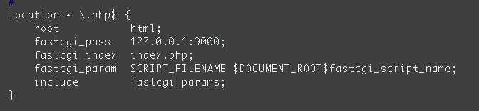

[toc]

# 第八章网络配置

## 命令配置网络:
- 可以通过 setup 命令,基本图形界面来配置.

## 网络相关的配置文件
- /etc/resolv.conf
> 指定 DNS 服务器用的(如果是自动获取 IP,可以不设定)
示例内容:
  - 阿里：
    - nameserver 223.5.5.5
    - nameserver 223.6.6.6
- /etc/sysconfig/network-scripts/ifcfg-eth0
> 注意: 红色 0,是变量, 不同的网卡,有不同的值.
比如 3 块网卡,分别对应 ifcgf-eth0 , eth1,eth2

- 对于网卡常用的字段如下

配置项 | 配置说明
------------|--------------
TYPE=Ethernet  | 网卡类型
DEVICE=eth0 | 网卡接口名称
ONBOOT=yes | 系统启动时是否自动加载
BOOTPROTO=static | 启用地址协议 --static:静态 IP --dhcp 自动获取
IPADDR=192.168.1.11 | 网卡IP地址
NETMASK=255.255.255.0 | 网卡网络地址
GATEWAY=192.168.1.1 | 网卡网管地址
HWADDR=00:0C:29:13:5D:74 | 网卡设备 MAC 地址[一般不能改]
BROADCAST=192.168.1.255 | 网卡广播地址 [可不写]

## 网络配置时常用的命令
- service network stop/start/restart 停/启/重启网络
- ifdown eth0 关闭 eth0 网卡
- ifup eth0 激活 eth0 网卡
- ifconfig/ip address 查看网卡信息

# 第九章远程管理
协议 | 端口
----|----
ftp|21
Ssh|22
Telnet|23
http|80
https|443
Mysql|3306
redis|6379
memcached  | 11211

# 第十章linux的用户管理
## 用户组
> 组文件 /etc/group
- groupadd 添加组
  - groupadd groupname
- groupdel 删除组
  - groupdel groupname
- groupmod 修改组
  - groupmod -n newname oldname (修改组名)
## 用户
> 用户文件 /etc/passwd
- useradd 增加一个用户
  - 用法 useradd [-g 组名] [-d 家目录]
  - 示例 useradd -g javaf -d /var/javaf03/ javaf03
- usermod 修改一个用户
  - 用法 usermod [-g 组名] [-d 家目录] [-l 新用户名] 用户名
  - 示例 usermod -g 502 -d /home/javaf03 javaf03
- userdel 删除一个用户
  - 用法 userdel 用户名
  - 示例 userdel javaf03
  - userdel mysql -r #-r 代表连用户的相关文件彻底删除
## 设置|修改 密码
- passwd username
> 注:
用户信息在/etc/passwod 文件里存储
用户密码在/etc/shadow 文件里加密存储
组信息在 /etc/group 文件里存储

# 第十一章权限管理

用户 | 权限 | 权限的数值表示法
-----|-----|--------------
u（所属者）  |r（读权限）   |  4
g（同组用户）|w（写权限）| 2
o（其他人）  |x（执行权限）   |  1

## 修改权限

### 相对修改法
- chomd u+x test.sh
- chmod u-rwx test.sh
- chmod g-r+wx test.sh
- chmod o-r+x test.sh

### 绝对修改法
- chmod 744 test.sh

### 修改文件的主人
- chown 新主人 某文件
  - chown wxjing test.sh
### 修改文件的组
- chgrp 新组 某文件
  - chgrp wxjing test.sh
> 同时修改文件主人和组
> chown wxjing:wxjing test.sh

# 第十二章rpm软件管理包
## 安装
  - rpm -i vsftpd-2.2.2-24.el6.i686.rpm
  - rpm -ivh vsftpd-2.2.2-24.el6.i686.rpm (显示安装进度条)
## 升级（已经安装过再次安装）
  - rpm -U vsftpd-2.2.2-24.el6.i686.rpm
## 卸载
  - rpm -e vsftpd
## 查找
  - rpm –q vsftpd
  - rpm –ql vsftpd (查询软件安装位置)
  - rpm –qa | grep ftp

# 第十二章yum软件管理器

## 安装
  - yum install httpd
- 查询时候安装成功
  - yum list installed | grep httpd
## 删除
  - yum remove httpd
## 更新
  - 检查可更新的 rpm 包
    - yum check-update
  - 更新所有的 rpm 包
    - yum update
  - 更新指定的 rpm 包,如更新 kernel 和 kernel source
    - yum update kernel kernel-source
  - 大规模的版本升级,与 yum update 不同的是,连旧的淘汰的包也升级
    - yum upgrade

# 第十三章软件编译
> 示例: yum 安装 gcc 编译环境,为编译 lnmp 做准备
> yum install gcc automake autoconf libtool gcc-c++

- 下载源码包
  - ```wget http://www.memcached.org/files/memcached-1.5.7.tar.gz```
- 解压
  - ```tar zxf memcached-1.5.7.tar.gz```
- 配置安装目录
  - ```./configure --prefix=/usr/local/memcached```
- 安装
  - ```make && make install```
# 第十四章编译lnmp

## 编译nginx
- 下载nginx
  - [选择 stable 版本下载](http://nginx.org/en/download.html)
- 解压
  - ```tar zxf nginx-1.14.0.tar.gz```
- 配置
  - ```./configure --prefix=/usr/local/nginx```
  - 如果提示缺少 pcre 库,则从 http://www.pcre.org/
  - 假设解压在/usr/local/src/pcre
- 再次配置
  - ``` ./configure --prefix=/usr/local/nginx  --with-pcre=/usr/local/src/pcre```
- ```make && make install```
- 启动 nginx
  - ```./sbin/nginx```
- 链接80端口
  - telnet localhost 80
- 如Apache占用80端口 杀掉进程
  - pkill -9 httpd
- 停止防火墙
  - service iptables stop

## 编译php
- 安装基础依赖库
  > ```yum install gd zlib zlib-devel openssl openssl-devel libxml2 libxml2-devel libjpeg libjpeg-devel libpng libpng-devel```
- 下载php源码
  > http://php.net/
- 配置 [参数配置详解](https://www.jianshu.com/p/0a79847c8151)
  > ```./configure --prefix=/usr/local/php7 --with-gd --enable-gd-native-ttf --enable-mysqlnd --with-pdo-mysql=mysqlnd --with-openssl --enable-mbstring --enable-fpm```
- 编译安装
  >```make && make install```
- 拷贝php-fpm.conf文件
  > ./etc/php-fpm.conf.default ./etc/php-fpm.conf
- 拷贝www.conf文件
  > cp ./etc/php-fpm.d/www.conf.default ./etc/php-fpm.d/www.conf
- 拷贝 php.ini
  > php源码包拷贝php.ini-development 至 php安转目录下的lib中

## 整合 nginx 和 PHP
- vim nginx.conf
  

## 编译安装mysql
[二进制安转](./mysql.md)
